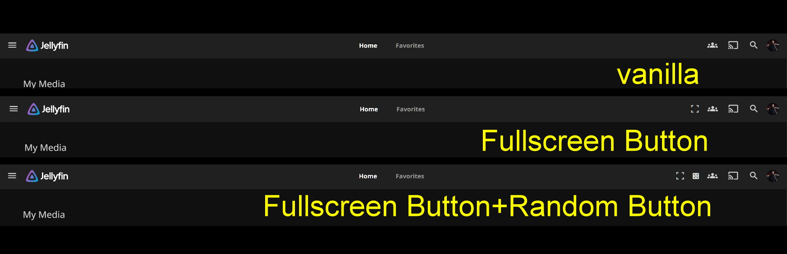

# Jellyfin Fullscreen Button (for Webinterface; need JavaScript Injector)

Adds a fullscreen toggle button to the Jellyfin web interface Top Navigation Bar, on the right side near the SyncPlay icon.

---

## 🔧 Installation

Make sure you have the official (or any) JavaScript Injector Plugin installed.

Copy the contents of `fullscreentogglebutton.js` and paste it into a new JavaScript Injector script.  
Give the script a name, save the settings, reload the page, and you are ready to go.

---

## 💡 What was the problem and what this addon should solve:

I come from the Kodi ecosystem, where I spent a lot of time working with skin XML files and convenience enhancements. Kodi is excellent for classic couch mode usage. Jellyfin, however, caught my interest as a powerful alternative for work mode and multitasking, while still being perfectly usable in couch mode. Being able to control the entire media library directly from the browser is extremely convenient.

### The situation

I primarily use Jellyfin on Windows 11, where the server is also running, together with Google Chrome. From time to time, I want to quickly switch into a more immersive cinema mode and enjoy the familiar fullscreen feeling known from Kodi. Until Jellyfin, I rarely had any need to use Chrome’s fullscreen mode.

### The problem

Entering fullscreen in Chrome is technically simple using the F11 shortcut. However, I mainly use a 61-key keyboard and constantly switching layers just to reach F11 is inconvenient. In couch or cinema mode, I often do not even have a physical keyboard nearby. Most interaction happens via mouse, and when necessary, through the Windows on-screen keyboard.

Using the browser menu to toggle fullscreen requires moving the mouse to the top right, opening the three-dot menu, and clicking the fullscreen icon at the bottom. That is multiple clicks and a long mouse travel. Exiting fullscreen without a keyboard also requires moving the mouse to the top center to reveal the exit button. While functional, the interaction is slow and inconsistent.

I experimented with Chrome extensions that add a fullscreen shortcut button, which improved things slightly, but the interaction paths were still different enough that no real muscle memory developed.

### The solution

The final and most intuitive solution was to add a fullscreen toggle button directly into Jellyfin’s Top Navigation Bar. Having a single, consistent button in the same location makes switching between windowed and fullscreen mode fast, predictable, and enjoyable. The result feels natural and finally restores that effortless fullscreen experience.

### Disclaimer: Button order and placement

If you already use one or more custom buttons that place elements in the same area of the Top Navigation Bar, the exact order of buttons may differ. If this fullscreen button is the first or only custom addition in that area, you can safely ignore this section.

If you already have other buttons, for example a random or shuffle button, the order may not be consistent. In my setup, the shuffle button always forced itself to the first position, regardless of what I tried.

Manipulating the button order only became possible by either editing both scripts or combining them into a single script. Neither approach was a viable solution for me.

In the end, I decided not to fight the button order any further. Since I use the fullscreen toggle slightly more often than the random button, having it positioned exactly as it is now is still perfectly fine and keeps it quickly accessible.

If anyone knows a clean and simple way to reliably control the sort order of multiple custom buttons in the Jellyfin header, feel free to share.

## 📸 Screenshot

---

## 🧪 Tested On

- Jellyfin 10.10.7  
- Windows 11  
- Google Chrome  

---

## 📜 License

MIT — free to use, modify, share.
